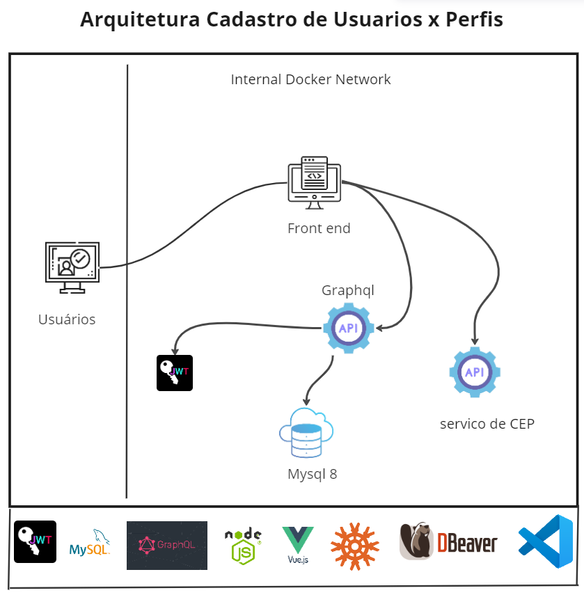

## Instalação do projeto

-  Premissas:

`windows 10 ou superior`

`ubuntu ou outro tipo de linux`

`ter o docker instalado no ambiente`

`ter o nodejs instalado no ambiente`

`ter o git client instalado no ambiente`

`preferencialmente usar a ide visual studio code`

`instalar uma ferramenta para visualização do banco de dados mysql no meu caso dbeaver`

- Baixar o projeto do github
  `git clone https://github.com/EduardoZava/dev-full-mvp2.git`

- Navegar para o diretorio criado do projeto
- E depois navegara para o subdiretorio aqui neste caso o app-back em dev-full-mvp2/app-back
- Executar comandos:
  
  `code .`

  `abrir o terminal dentro do vscode`

  `se nao abriu o ideal é que seja um terminal bash ou pwsh`

  `npm i package.json`

  `npm -i knex mysql2`

  `docker pull mysql`

  `docker network create my-network`

  `docker run --name mydb -p 3306:3306 -e MYSQL_DATABASE=mydb -e MYSQL_ROOT_PASSWORD=xpto1234 -d mysql:latest`

  `docker network connect my-network mydb`

  `npx knex migrate:latest`  para a criacao das tabelas de 

- Uma vez sendo feitas estas instalações verificar se o mysql bd mydb foi criado com sucesso com suas tabelas
- npm audit fix também pode ser usado para minimizar erros de compatibilidade de versões para execução do backend
- Caso afimativo o banco estiver ok proximas vezes é só executar o script shell "pipeline" do projeto:

`.\dockerscript.sh`

## Observações e anotações sobre dificuldades e bugs do projeto

## dockerscript
-  É o arquivo shell script que cria os containers docker é o arquivo que representa a minha pipeline para fazer o deploy da aplicação no docker

## Instalação do BD

`docker pull mysql`

-  String de conexão para acessar este banco porcomo root remotamente no dbeaver
`jdbc:mysql://172.18.0.3:3306/mydb?allowPublicKeyRetrieval=True`

-  Este ip do banco de dados foi determinado após a instalação de uma netwok pelo docker 
-  descobeto pelo docker inspect 

`docker run --name mydb -p 3306:3306 -e MYSQL_DATABASE=mydb -e MYSQL_ROOT_PASSWORD=xpto1234 -d mysql:latest`

## Para execução das criacao de tabelas pelo knex

- Cria as tabelas do mydb
`npx knex migrate:latest` 

- cria uma mygration para a criacao de uma tabela
`npx knex migrate:make tabela_endereco`

- executa rollback desfazendo a criação de tabels
`npx knex migrate:rollback`

- Referencia para um erro no knex ao rodar os migration 
- Tem que instalar um client: 'mysql2'

[Client does not support authentication MYSQL 8](https://github.com/knex/knex/issues/3233)

[Instalação do arquivo mysql2 driver de coneção para o knex acessa mysql 8](https://www.npmjs.com/package/mysql2)

`npm install --save mysql2`

## Executa a api backend

npm run start
#e o apollo server irá executar nesta porta 
http://localhost:4000/

## Comandos úteis do docker

-   Executar o inspect em um container
`docker inspect container_name`
`docker inspect container_id`
-   Entrar dentro de um container no windows
`docker exec -it container_id //bin//sh`
-   Para ver instacias dos containers que estao ativas ou stopadas
`docker ps -a`
-   Remover todos os contêineres sem uso  
`docker container prune`
-   Parar todos os containers  
`docker stop $(docker ps -q)`
-   Remover todas as imagens locais  
`docker image prune`
-   Remove volumes "órfãos"  
`docker volume prune`
-   Mostra uso de recursos dos containers rodando  
`docker stats $(docker ps --format {{.Names}})`
-   Listar containers parados  
`docker ps -f "status=exited"`
-   Acessar terminal do container  
`docker exec -it container bash`
-   Salvar uma imagem  
`docker save -o imagem.docker imagem`
-   Carregar imagem  
`docker load -i imagem.docker`

-   docker create network
  
    [Link com instrucoes para criacao de uma network no docker](https://forums.docker.com/t/how-to-create-a-network-of-containers-that-can-communicate-with-each-other-interchangably/134292/2)

