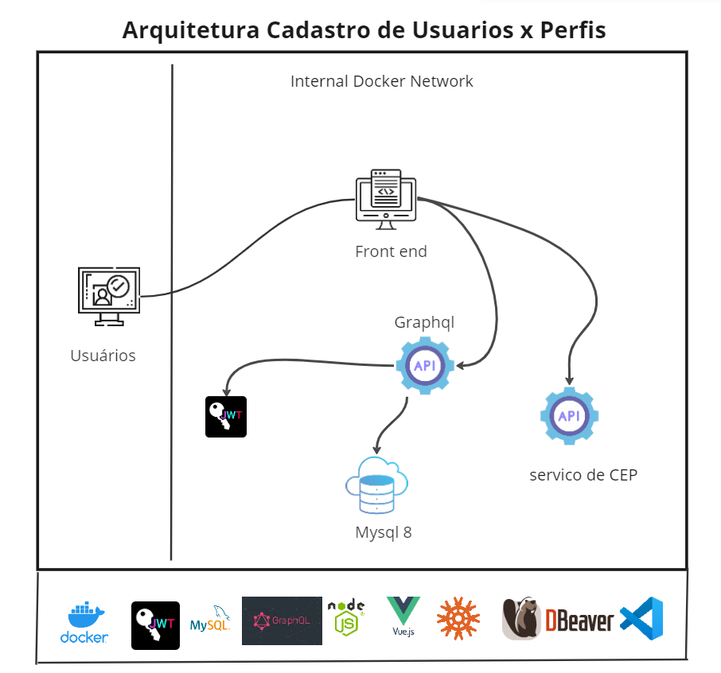

## Instalação do projeto

-  Premissas:

`windows 10 ou superior`

`ubuntu ou outro tipo de linux`

`ter o docker instalado no ambiente`

`ter o nodejs instalado no ambiente`

`ter o git client instalado no ambiente`

`preferencialmente usar a ide visual studio code`

- Baixar o projeto do github
  `git clone https://github.com/EduardoZava/dev-full-mvp2.git`

- Navegar para o diretorio criado do projeto
- E depois navegara para o subdiretorio aqui neste caso o app-front em dev-full-mvp2/app-front
- Executar comandos:
  
  `code .`

  `abrir o terminal dentro do vscode`

  `se nao abriu o ideal é que seja um terminal bash ou pwsh`

  `npm i `

  `npm audit fix`

- Uma observacao é para no caso linux muitas das vezes o docker so executa som o sudo na fremnte do comando
- Proximas vezes é só executar o script shell "pipeline" do projeto:

`.\dockerscript.sh`

## Observações e anotações sobre dificuldades e bugs do projeto

## dockerscript
-  É o arquivo shell script que cria os containers docker é o arquivo que representa a minha pipeline para fazer o deploy da aplicação no docker

## Executa a api frontend

npm run server

http://localhost:8080/

## Comandos úteis do docker

-   Executar o inspect em um container
`docker inspect container_name`
`docker inspect container_id`
-   Entrar dentro de um container no windows
`docker exec -it container_id //bin//sh`
-   Para ver instacias dos containers que estao ativas ou stopadas
`docker ps -a`
-   Remover todos os contêineres sem uso  
`docker container prune`
-   Parar todos os containers  
`docker stop $(docker ps -q)`
-   Remover todas as imagens locais  
`docker image prune`
-   Remove volumes "órfãos"  
`docker volume prune`
-   Mostra uso de recursos dos containers rodando  
`docker stats $(docker ps --format {{.Names}})`
-   Listar containers parados  
`docker ps -f "status=exited"`
-   Acessar terminal do container  
`docker exec -it container bash`
-   Salvar uma imagem  
`docker save -o imagem.docker imagem`
-   Carregar imagem  
`docker load -i imagem.docker`

-   docker create network
  
    [Link com instrucoes para criacao de uma network no docker](https://forums.docker.com/t/how-to-create-a-network-of-containers-that-can-communicate-with-each-other-interchangably/134292/2)

## Customize configuration
  [Configuration Reference Vue.js](https://cli.vuejs.org/config/).
